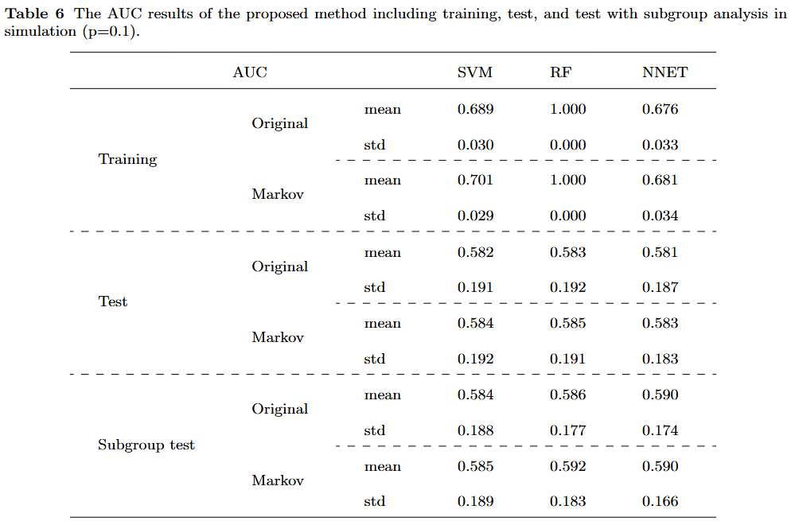
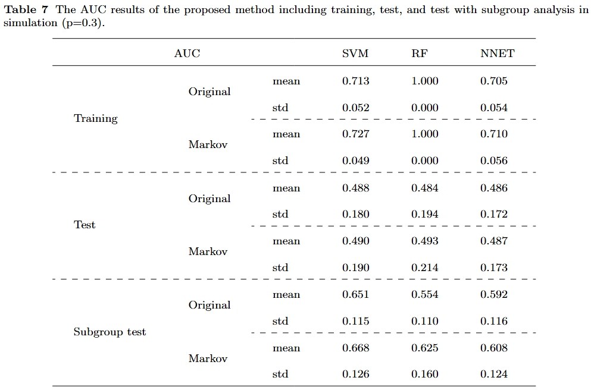
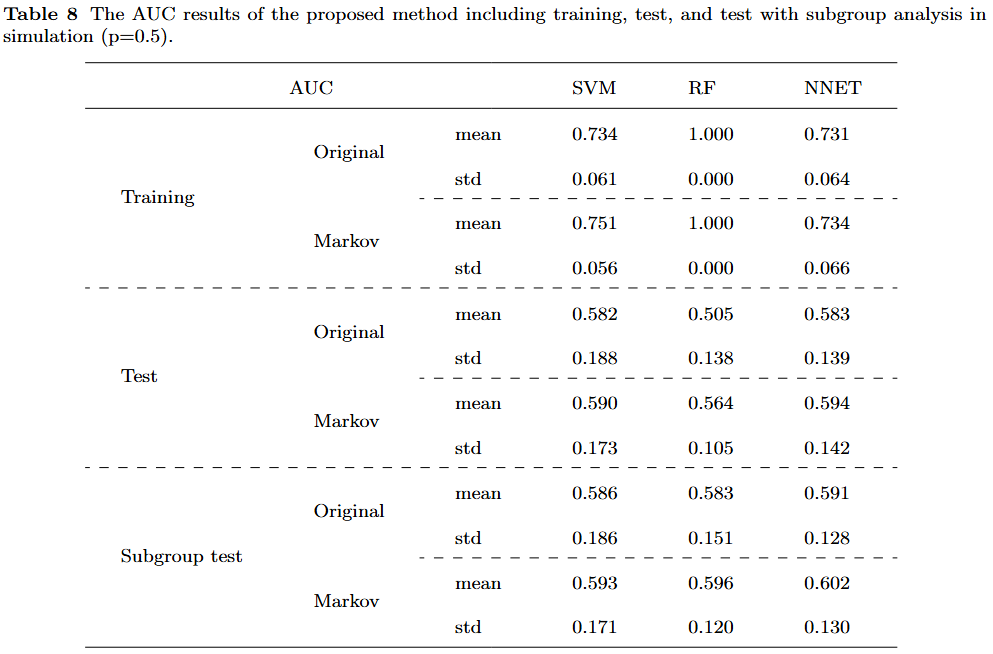
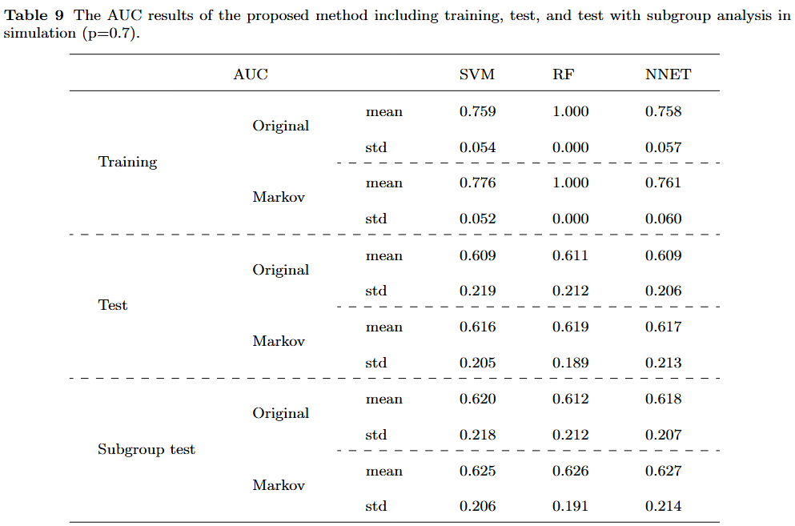
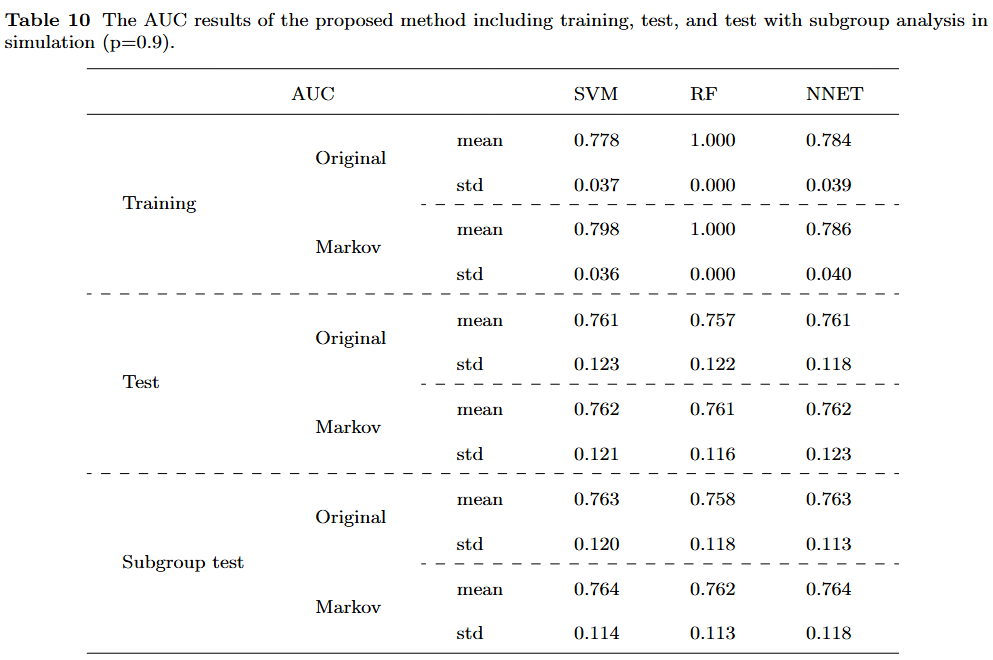
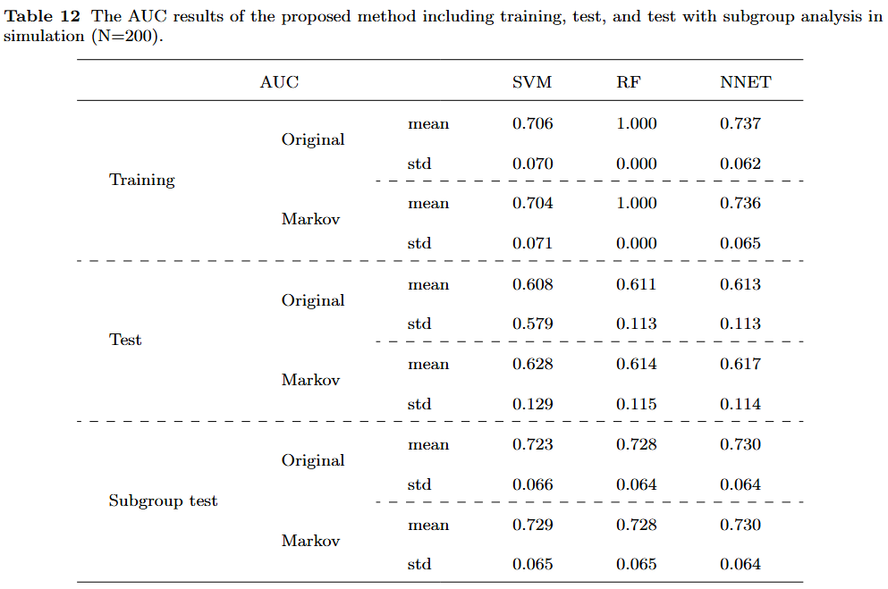
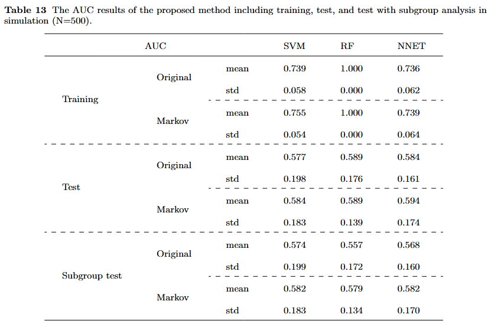
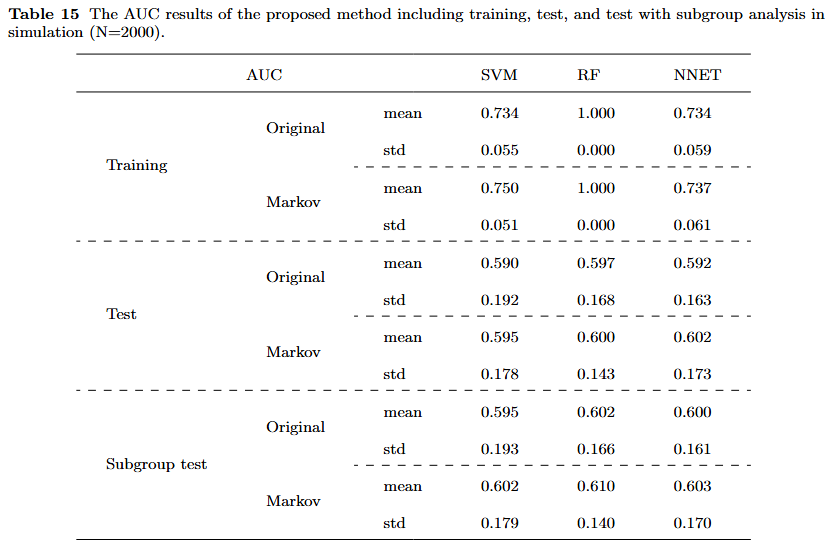

# MarkovTransitionFE

This is the official repository of **Medical status forecasting with Markov feature engineering for autocorrelated categorical response variable.**

Fig.1 Framework Overview.

### Numerical simulations under different time lengths 𝑇

### Numerical simulations under different binomial distribution parameter settings *p*

### different population sizes *N*

