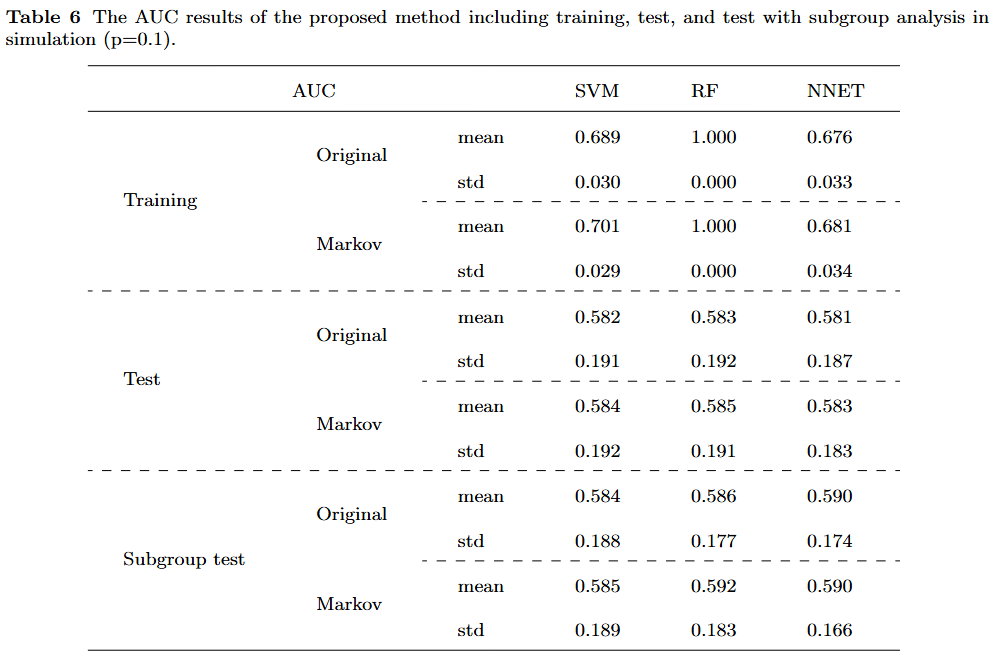
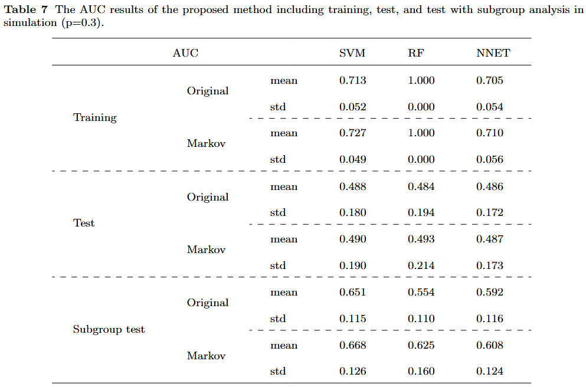
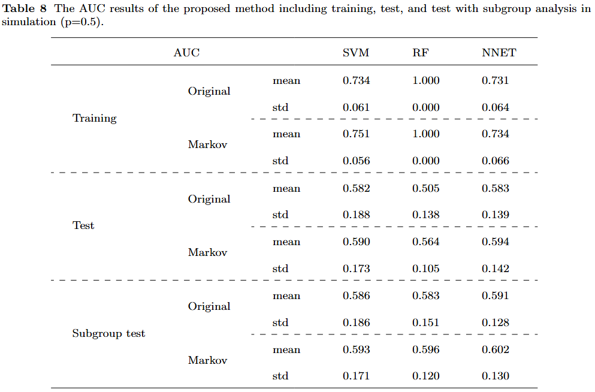
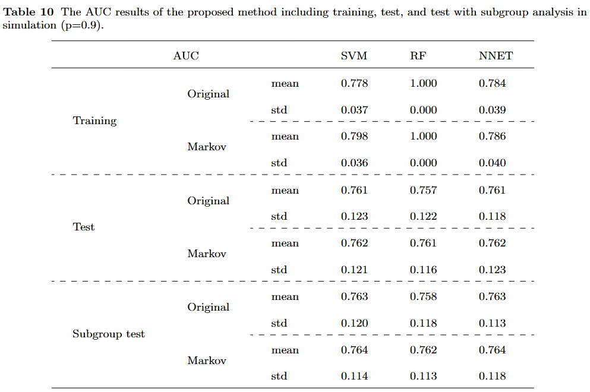
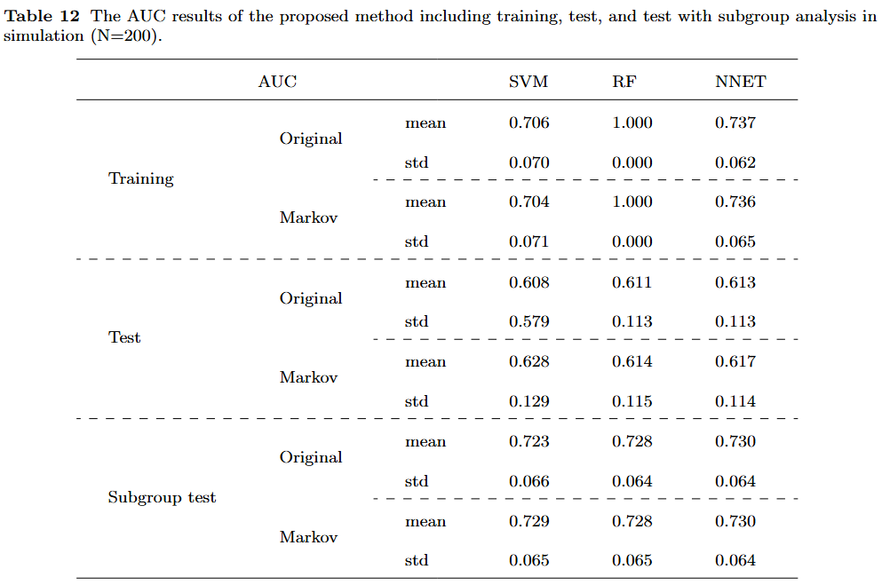
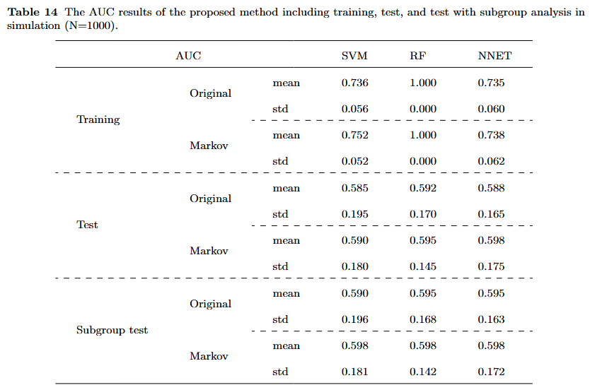
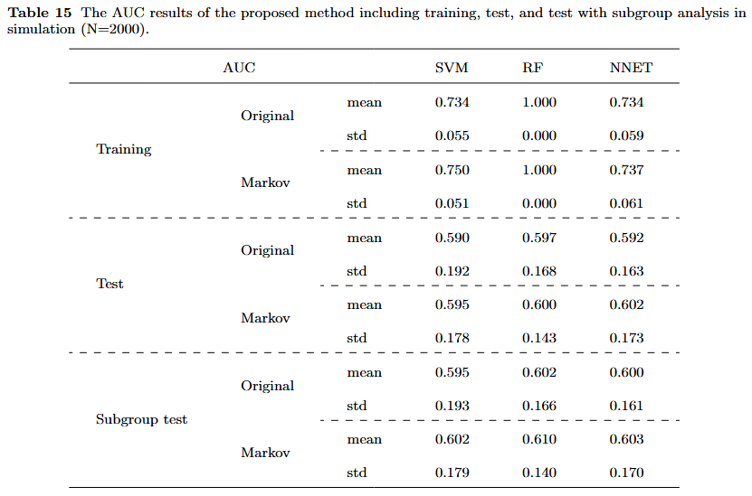

# MarkovTransitionFE

This is the official repository of **Medical status forecasting with Markov feature engineering for autocorrelated categorical response variable.**

Fig.1 Framework Overview.

We re-evaluated the subgroup test results using chronological train-test splits (80% training, 20% holdout) for subgroup threshold estimation. The revised Subgroup-test AUCs are consistent with the original rankings: Markov+ $y_t$ achieves the highest performance across all models (e.g., iTransformer: 0.908; RF: 0.891; LSTM: 0.878). Followed by Original+ $y_t$ (iTransformer: 0.881; RF: 0.872).

### Numerical simulations under different time lengths 𝑇

### Numerical simulations under different binomial distribution parameter settings *p*

### different population sizes *N*

